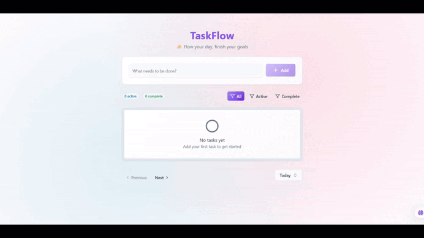

# TaskFlow

[](https://www.docker.com/)
[](https://reactjs.org/)
[](https://fastapi.tiangolo.com/)
[](https://www.mongodb.com/)
[](LICENSE)

Fullstack task management app built with **FastAPI**, **React (Vite)**, and **MongoDB**. Fast setup, smooth UI, and a clean API.

<p align="center">
  <a href="https://youtu.be/XUO0np7tThU">
    
  </a>
</p>

## Highlights

TaskFlow focuses on speed, clarity, and a good developer experience. The stack is modern and production-friendly, with Docker support for one-command setup.

- **FastAPI backend** with async performance and auto Swagger docs
- **React + Vite frontend** for fast HMR and smooth UI
- **MongoDB storage** with a document-first data model
- **Docker Compose** to run the full stack in one command

## Repository Structure

The repository is split into `backend/` and `frontend/` with a shared Docker configuration at the root. Each side is independently runnable while still wired together through environment variables.

```
fullstack-todo-app/
|-- backend/               # FastAPI backend
|-- frontend/              # React + Vite frontend
|-- public/                # Demo assets
|-- docker-compose.yaml
|-- LICENSE
`-- README.md
```

## Getting Started

You can run everything with Docker or start the backend and frontend locally. Both paths are documented below and use the same API base URL concept.

### Docker Setup (Recommended)

Create a root `.env` file and then start the stack with Docker Compose. This brings up the API, UI, and Mongo Express in one step.

```env
BACKEND_URL=http://todo-backend:8000/api
MONGO_EXPRESS_USERNAME=admin
MONGO_EXPRESS_PASSWORD=admin123
```

```bash
docker compose up -d --build
```

### Local Development (No Docker)

Set up the backend with a Python virtual environment, then install frontend dependencies and run Vite. You will also need a local MongoDB instance if you are not using Docker.

```bash
cd backend
python -m venv .venv
.venv\Scripts\activate      # Windows
source .venv/bin/activate   # macOS/Linux
pip install -r requirements.txt
uvicorn main:app --reload --port 8000
```

```bash
cd frontend
npm install
npm run dev
```

## Usage

Create, edit, complete, and delete tasks directly from the UI with quick filters for Today, Week, and Month. The experience is designed to be simple and fast for daily task tracking.

### API Reference

All endpoints are prefixed with `/api` and return JSON, and Swagger UI is available at `http://localhost:8000/docs`. The table below lists the core task endpoints.

| Method   | Endpoint          | Description      |
| -------- | ----------------- | ---------------- |
| `GET`    | `/api/tasks`      | List all tasks   |
| `GET`    | `/api/tasks/{id}` | Get task details |
| `POST`   | `/api/tasks`      | Create a task    |
| `PUT`    | `/api/tasks/{id}` | Update a task    |
| `DELETE` | `/api/tasks/{id}` | Delete a task    |

### API Examples

Use these curl commands to create and query tasks during development. They target the default local API URL.

```bash
curl -X POST http://localhost:8000/api/tasks \
  -H "Content-Type: application/json" \
  -d '{"title": "My Task", "description": "Task description"}'
```

```bash
curl http://localhost:8000/api/tasks
```

## License

MIT License. See `LICENSE` for details.
